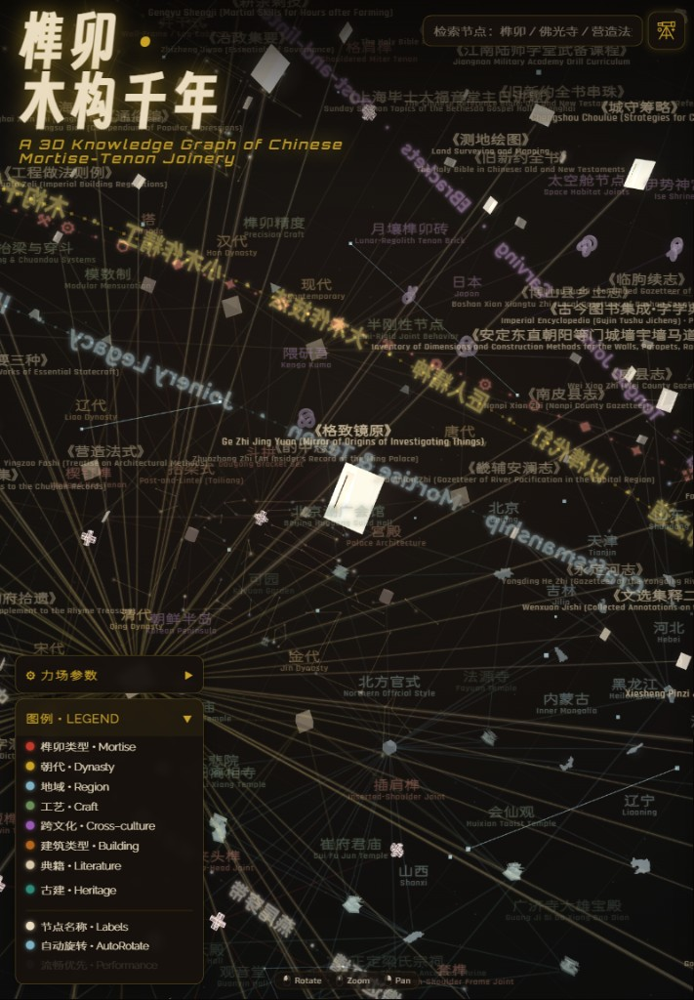
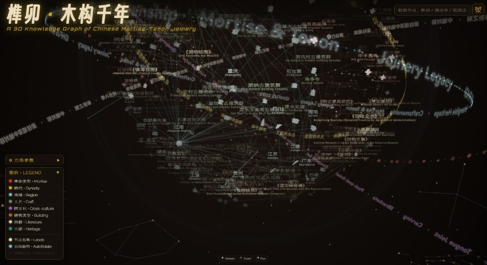

# Tenennium · 榫卯 · 木构千年

三维交互式知识图谱：榫卯类型、古建、典籍、工艺与跨文化关联。

**站点：** [tenennium.florescentmice.fun](https://tenennium.florescentmice.fun)

<!-- 按原图像宽高比分配宽度，并排同高且合计撑满行宽：711/1024 与 1024/560 -->
<p align="center">
  
  
</p>

## 快速开始

### 方式一（推荐）
进入 `比赛提交包/`，双击 `启动预览.bat`。

### 方式二
在项目根目录或提交包目录执行：

```bash
python -c "import http.server,socketserver; socketserver.TCPServer(('127.0.0.1',8080), http.server.SimpleHTTPRequestHandler).serve_forever()"
```

浏览器打开：http://127.0.0.1:8080/

> 请通过本地 HTTP 服务打开（WebGL），勿直接双击 `index.html`。

### 方式三
通过公网访问（正在上线）


## 仓库结构

| 路径 | 说明 |
|------|------|
| `index.html` | 单页应用入口 |
| `assets/` | favicon、Three.js、3d-force-graph |
| `data/sunmao-graph.source.js` | 图谱数据源 |
| `data/illus/` | 榫卯示意图 |
| `比赛提交包/` | 开箱即用编译成品 |

## 操作

- 鼠标：左键旋转 · 滚轮缩放 · 右键平移
- 触屏：单指旋转 · 双指缩放平移
- 点击节点查看知识卡片；顶栏可检索定位
